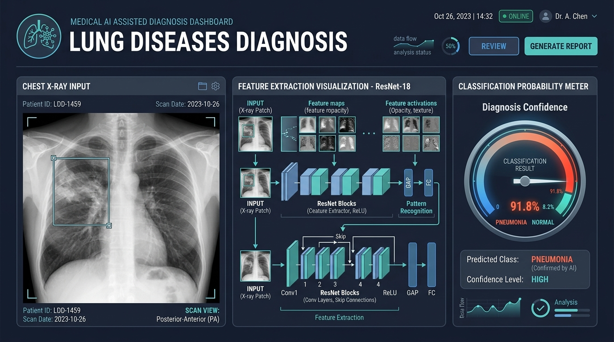
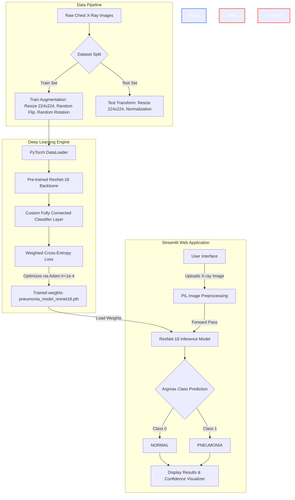

# 🫁 Lung Diseases Diagnosis (Chest X-Ray Pneumonia Detection)

[](https://www.python.org/)
[](https://pytorch.org/)
[](https://streamlit.io/)
[](LICENSE)

An end-to-end Deep Learning application that classifies chest X-ray images to detect **Pneumonia** using Transfer Learning with a fine-tuned **ResNet-18** model in PyTorch. The project features a clean, interactive web interface built with **Streamlit** for real-time inference.

---

## 🖥️ System Architecture & Interface Preview

Below is an infographic illustrating the general structure of the automated diagnosis workflow:



---

## 📊 Technical Workflow

This flowchart describes the data processing, model training, and Streamlit inference pipeline:



---

## ⚡ Key Features

* **Transfer Learning:** Fine-tuned ResNet-18 backbone pre-trained on ImageNet to leverage advanced feature extraction.
* **Weighted Class-Entropy:** Addressed dataset imbalance (Normal: 317 samples vs. Pneumonia: 855 samples) using computed class weights during training.
* **Interactive UI:** A lightweight web application built with Streamlit allowing doctors and users to drag-and-drop X-ray images.
* **Real-time Inference:** Rapid classifications (< 100ms) with clean normal/pneumonia status outputs.

---

## 🛠️ Tech Stack

* **Core Language:** Python 3.8+
* **Deep Learning Framework:** PyTorch & Torchvision
* **Frontend/Deployment:** Streamlit
* **Scientific Computing:** NumPy, OpenCV, Matplotlib, Scikit-learn
* **Utilities:** TQDM, Pillow

---

## 🚀 How to Run Locally

Follow these step-by-step instructions to set up the project on your machine:

### Step 1: Clone the Repository
```bash
git clone https://github.com/shaan774-lab/lung_diseases_digno.git
cd lung_diseases_digno
```

### Step 2: Create a Virtual Environment
We recommend using standard `venv` or `conda`:

**Using venv:**
```bash
python -m venv venv
# Activate on Windows:
venv\Scripts\activate
# Activate on macOS/Linux:
source venv/bin/activate
```

**Using Conda:**
```bash
conda create -p env python=3.8 -y
conda activate ./env
```

### Step 3: Install Dependencies
```bash
pip install -r requirements.txt
```

### Step 4: Run the Streamlit Application
Start the Streamlit server:
```bash
streamlit run app.py
```
This will automatically open the app in your default web browser at `http://localhost:8501`.

---

## 📂 Project Structure

```text
lung_diseases_digno/
│
├── assets/
│   └── lung_disease_dashboard.jpg       # Infographic diagram banner
│
├── notebook/
│   └── experiment.ipynb                 # Model exploration, data loading, and training script
│
├── app.py                               # Main Streamlit web application
├── requirements.txt                     # Python packages list
└── .gitignore                           # Git ignore configurations (ignores model weights and local data)
```

---

## 🧠 Model Training Details

The model was configured and trained in `notebook/experiment.ipynb` with the following parameters:
- **Optimizer:** Adam
- **Learning Rate:** `0.0001` (`1e-4`)
- **Loss Function:** `nn.CrossEntropyLoss` with weights adjusted to handle the dataset class balance.
- **Batch Size:** `32` (or configured per hardware capacity)
- **Epochs:** `10`
- **Output Weights:** Saved as `pneumonia_model_resnet18.pth`

> [!NOTE]
> The trained weights file `pneumonia_model_resnet18.pth` is excluded from the GitHub repository via `.gitignore` because of its file size. To run inference locally, you should place your trained model weights in the root directory.

---

## 👥 Contributors

* **Shaan Saxena** - [shaan774-lab](https://github.com/shaan774-lab)
